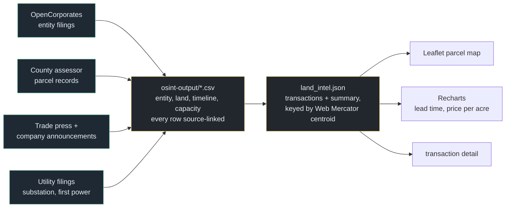

# Data Center Parcel Dashboard

Land-acquisition intelligence for hyperscale data-centre development: 19 parcel
transactions across 7 campus clusters, 2,503 acres and $467 m, each joined to the
site's projected capacity and first-power date so the **land-to-power lead time**
becomes a measurable quantity. Median lead time across these transactions is
**47 months** — with a spread from 5 to 92. Leaflet map, Recharts analytics,
React + TypeScript.

Built around a question that parcel records answer and press releases do not:
*how long before a company breaks ground does it quietly buy the land, and can you
see the next campus coming from the deed?*


*Placeholder still. Map, parcel selection and the timeline analytics are interactive — a demo GIF replaces this.*

**Live → [dc-parcel-dashboard.vercel.app](https://dc-parcel-dashboard.vercel.app/)**

---

## What it computes

| | |
|---|---|
| Transactions | 19 |
| Campus clusters | 7 |
| Acres | 2,503 |
| Disclosed consideration | $467 m |
| Operators | Google (12) · AWS (5) · Microsoft (1) · xAI (1) |
| **Land-to-first-power lead time** | **median 47 months** (range 5–92) |

Per transaction: buyer, seller, acreage, amount, price per acre, transaction date,
the site's first-power date, its maximum IT capacity, and the derived lead time.

### Shell-entity resolution

Hyperscalers rarely buy land under their own name. The OSINT layer resolves the
shells back to their parents, with an evidence link and a confidence grade on each:

| Shell entity | Parent | Evidence |
|---|---|---|
| Razor5 LLC | AWS / Amazon Data Services | Delaware filing + press |
| Hatchworks LLC | Google | County records + press |

**Every row in `osint-output/` carries a `Source_URL`** — OpenCorporates filings,
county assessor records, local reporting, and company announcements. Nothing in
this dataset is asserted without a link.

**The details that would have made it wrong:**

- **Lead time is measured from *transaction date* to *first power*, not from
  announcement.** Announcement dates are a PR artefact and typically land years
  after the deed; measuring from them would compress every lead time and miss the
  entire point.
- **Price per acre is derived, not quoted.** Several parcels have undisclosed
  consideration, so aggregate dollar figures cover only disclosed transactions and
  are a floor.
- **A campus is several parcels.** Google Fort Wayne is multiple deeds; rolling to
  the cluster before computing lead time avoids counting one site's timeline
  several times.
- **Capacity figures are projections.** `maxITCapacityMW` is what the operator or
  the utility filing states as ultimate build-out, not installed capacity.

---

## Architecture



The important edge: **the CSVs are the record and the JSON is the build product.**
`land_intel.json` is keyed by projected centroid because that is what the map
needs; the auditable version is the four source-linked CSVs, and they are what a
reader should check.

---

## Quickstart

```bash
npm install
npm run dev
```

```bash
npm run build
```

No API keys. Leaflet uses open tiles and all data is committed.

---

## Using it

- **Select a parcel and the analytics scope to its cluster**, because a single deed
  rarely tells you anything — the campus it belongs to does.
- **Lead time is the headline chart.** It is the one number here that generalises:
  a distribution you can hold against a newly-filed deed to estimate when power
  arrives.
- **Price per acre is the second signal.** A large premium over local agricultural
  comparables is often the earliest public trace of a hyperscale buyer behind a
  shell.

---

## Project layout

```
osint-output/
  01_entity_resolution.csv     shell entity -> parent, confidence, evidence link
  02_land_acquisition.csv      APN, owner, acreage, date, amount, county, source
  03_development_timelines.csv 41 dated milestones with sources
  04_capacity_infrastructure.csv  projected MW, utility, substation status, first power
client/
  public/data/land_intel.json  the build product the app reads
  src/pages/Dashboard.tsx      map + analytics
server/index.ts                static serving only
```

---

## Limits

**Nineteen transactions is a sample, not a census.** The median lead time is a
useful order-of-magnitude figure and not a forecast. The 5-month minimum is almost
certainly a late parcel added to an already-assembled campus rather than a genuine
five-month land-to-power build.

**Coverage is biased toward what got reported.** Quiet acquisitions with no press
coverage and no contested rezoning are systematically missing, and those are
plausibly the majority.

**Amounts are disclosed values only.** Where a sale price is undisclosed the
transaction still appears with acreage but contributes nothing to the dollar
totals — so aggregate spend is a floor, not an estimate.

**Assessor data has lag and error.** Parcel ownership records update on county
schedules, and shell-to-parent resolution is an inference from public filings
graded by confidence, not a certainty.

**Seller names are county public record.** Most are corporate; a few are private
individuals, reproduced as they appear in the assessor data. They are published
because the transaction record is public, but that is a judgement call rather than
an obvious one.

---

## Stack

React · TypeScript · Vite · Leaflet · Recharts · Tailwind · Radix UI. Deployed on
Vercel.
